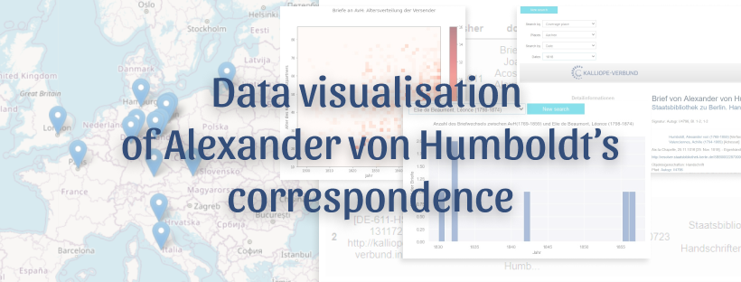

# The project
## About
### History
> "The international nature of Humboldt's biography and the sad fate of his estate had scattered the materials not only all over Germany but worldwide, so that even international cooperation was necessary if one wanted to get hold of all the sources."

The project of reconstructing Alexander von Humboldt's correspondence began with the founding of an Alexander von Humboldt Commission at the BBAW in 1956. Two years later a Berlin working position of the new commission was established. Then in 1994, a new academic Advisory Commission was instituted for Humboldt Research Unit until 2014. This way, the project ["Travelling Humboldt - Science on the Move"](https://edition-humboldt.de/?&l=en) is the continuation of this long-term work and proposes a print and digital edition of Alexander von Humboldt's travel journals and correspondence since 2015.

### About this project
This experimental project seeks to discover, explore and visualise the correspondence of Alexander von Humboldt. It is the result of the first part of Axelle Lecroq´s four-month internship within the BBAW's project ["Travelling Humboldt - Science on the Move"](https://edition-humboldt.de/?&l=en).

The idea started with the analogous collection of Alexander von Humboldt's letters held at the BBAW. Decades ago, the academy sought to catalogue the scientist's correspondence. All these letters are still kept in a similar way with an old archiving system. Only the research aid has been digitally reproduced by Ann McKinney during her intership into the project. 

The original idea was initially to reconstruct in a digital way at least part of this correspondence collection and to discover it with new possibilities. 


## Data
The [Kalliope Verbund](https://kalliope-verbund.info/) is certainly the largest catalogue of archives of partly German speaking institutions. The data of the letters sent and received by Alexander von Humboldt (AvH) have been retrieved from the Kalliope's API in Dublin Core format.

In order for this digital project to be representative of the years of work carried out by the BBAW, it was important to include data from outside Germany. It was initially agreed to use data from the [Bibliothèque nationale de France](https://catalogue.bnf.fr/index.do) (BnF), which offers a user-friendly API. The data of Alexander von Humboldt's correspondence preserved at the [Bibliothèque nationale de France](https://catalogue.bnf.fr/index.do) and accessible on the latter's online catalogue in csv format were then retrieved.

The institutions listed in the BBAW search help are far from being only European, the documents concerning AvH and kept at the [American Philosophical Society](https://www.amphilsoc.org/library/search-collections) were also retrieved, in EAD format.

### Letter's quantity
Based on the 1962 censuses, it was been estimated that Humboldt wrote up to 3,000 letters a year. Extrapolated, this resulted in an estimated total of 35,000 to 50,000 letters from Humboldt's hand; this estimate is still valid today ([Biermann and Lange 1962, p. 226](documentation/bibliography.md)). In the case of the left letters, most of which are now considered lost, Biermann and Lange assumed approximately 100,000 letters. 


_*This is the number of entries. This means that an entry can represent more than one letter. This is often the case for data from the BnF where one entry may represent several dozen documents._

The analogue collection part of this table was written by Ann McKinney. The works used to compile this table are listed in the [bibliography available in `documentation`](documentation/bibliography.md).

## Work on the data
All the data were cleaned and homogenised in order to be able to search in them. In order to visualise the letter on a map, new data were also added for each of the letters:
- geopoints, geoname ID and [humboldt digital edition](https://edition-humboldt.de/?&l=en) identifier (edh) ID for institution's place
- geopoints, geoname ID and edh ID for coverage place

## Repository structure
```
corresp-humboldt-dataviz
    ├── documentation/...
    ├── notebooks
    │      ├── data
    │      │    ├── edh_findbuch.json
    │      │    └── records.json
    │      ├──  utils
    │      │    ├── mapviz.py
    │      │    ├── prepare_data.py
    │      │    ├── search_by.py
    │      │    ├── search_dynamic.py
    │      │    ├── widgets.py
    │      │    └── women.py
    │      ├── mapviz.ipynb
    │      └── search.ipynb
    ├── .gitignore
    └── requirements.txt

```

## Used tools
In the absence of developing an entire website allowing for a thorough user experience, it was decided to start by using jupyter notebooks. These interactive and powerful notebooks have the advantage of offering numerous widget possibilities and data visualisations.
Several libraries were used for data visualisations, among them the main ones are:
- ipywidgets for widgets in the jupyter notebook
- matplotlib for histograms
- ipyleaflet for map visualisations


# Discover the Alexander von Humboldt's correspondence
## First launch
Prerequisite: python3

*You can install it via this [site](https://www.python.org/downloads/). As a reminder: most Linux systems already have Python installed.*

1. Clone this git repository : `git clone https://github.com/edition-humboldt-collection/corresp-humboldt-dataviz.git` and go inside
2. Install a virtual environment : `virtualenv -p python3 env`
3. Activate the virtual environment via `source env/bin/activate`
4. Install `requirements.txt` : enter into the corresponding folder `corresp-humboldt-dataviz` and run the command `pip install -r requirements.txt`
5. Run the jupyter notebook with the command: `jupyter notebook`. The notebook should automatically launch in your browser.

## Launch
1. Go into the corresponding folder `corresp-humboldt-dataviz`
2. Activate the virtualenv : `source env/bin/activate`
3. Run the jupyter notebook with the command : `jupyter notebook`.


